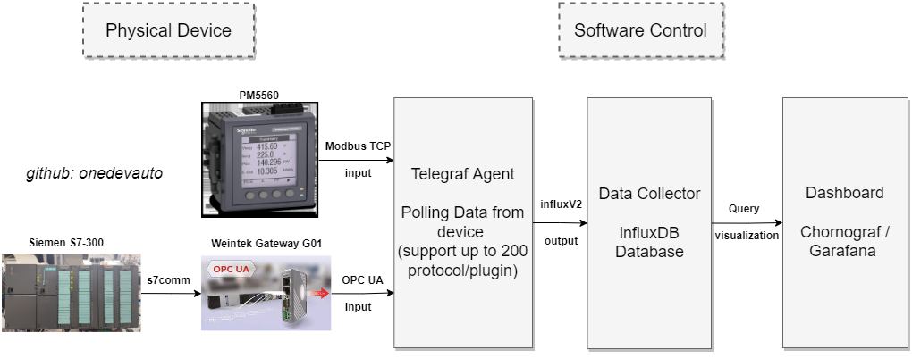

# TICKstack_pharma4.0
Implementation TICK Stack Architecture for pharma 4.0 (monitoring OEE & Real time data machine) using OS Windows 64bit platform. Basically it's more easy to implementing in linux platform or docker, so why implementation this methode on windows platform? based on my experience as OT engineering, i alway find that standaritation platform OS in manufacturing is windows base. In fact majority OT engineer/automation engineer not familiar with Linux OS. So i hope this repository can guide everyone that want to starting POC/Experiment this architecture in Windows platform.  

## Another Use Cases for TICK Stack Architecture
TICK aligns well with many potential use cases. It especially fits uses which rely upon triggering events based on constant real-time data streams. An excellent example of this would be fleet tracking. TICK can monitor the fleet data in real-time and create an alert condition if something out of the ordinary occurs. It can also visualize the fleet in its entirety, creating a real-time dashboard of fleet status.
IoT devices are also a strong point for TICK. Solutions that rely upon many IoT devices combining date streams to build an overall view, such as an automated manufacturing line, work well with TICK. TICK can trigger alert events, and visualize the entire status of a production line easily.

## What is TICK Stack ?
The TICK Stack is an acronym for a platform of open source tools built to make collection, storage, graphing, and alerting on time series data incredibly easy. The “I” in TICK stands for InfluxDB. InfluxData provides a Modern Time Series Platform, designed from the ground up to handle metrics and events. InfluxData’s products are based on an open source core. This open source core consists of the projects Telegraf, InfluxDB, Chronograf, and Kapacitor—collectively called the TICK Stack.

The Components are:
- Telegraf — Agent to collect and report metrics and events
- InfluxDB — High-performance time-series database
- Chronograf — The user interface for the platform
- Kapacitor — Data processing engine that can process, stream and batch data from InfluxDB

## Minimum System Requirment
- Windows 7 - 10
- 64-bit AMD architecture
- Powershell

## TODO
- [X] General Introduction 
- [ ] Explaine step installation
- [ ] Input Configuration
- [ ] How to run system in windows

## Step Instalation

## Example Implementation 
This is example implementation to demonstration how easy the sistem build without deep knowlage in IT area with impressive result. In this example telegraf agent pooling data from Power Monitorin PM5560 via modbus TCP and data machine via OPC UA.

### Alternative PLC Siemens configuration
S7-300 and S7-400 usually use rack 0 and slot 2 and dont require additional configuration.

S7-1200 and S7-1500 usually use rack 0 and slot 1 and you need to enable the PUT/GET operations in the hardware configuration of your PLC and you have to set DBs as non-optimized.

Be aware of security issue. Once S7 Communication is enabled in a CPU, there is no way to block communication with a partner device. This means that any device on the same network can read and write data to the CPU using the S7 Communication protocol. For this reason, I would recommend using the native OPC.UA server for the newer S7-1200 and S7-1500 PLCs. See the OPC.UA telegraf plugin.

Source : [nicolasme-s7comm](https://github.com/nicolasme/s7comm)

## Configuration 

## Reference Resource:
- [InfluxDB Official](https://docs.influxdata.com/influxdb/v2.4/install/?t=Windows)
- [An Introduction to TICK stack for IoT](https://iotbyhvm.ooo/tick-stack/)
- [InfluxDB (TICK Stack)](https://medium.com/yavar/influxdb-tick-stack-part1-28bd04d10a18)

